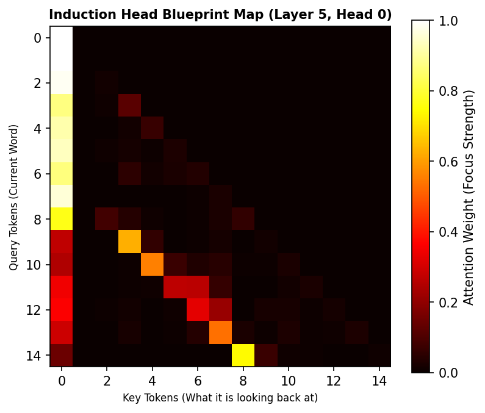

# AI Safety Paper Replication: Induction Head Circuit Detection

This repository contains a functional from-scratch replication of the circuit analysis methodologies established in Anthropic's seminal paper: **"A Mathematical Framework for Transformer Circuits"**.

## 🎯 The Purpose
Induction heads are the primary engine behind an LLM's ability to perform **in-context learning**. This project maps out how `gpt2-small` develops these tracking algorithms without human programming by feeding repetitive input loops (`[A][B]...[A]➔[B]`) and scoring the resulting internal attention matrices.

## 📊 Evaluation Artifacts
* `replication.py`: Core algorithm validating shifted-diagonal token weights.
* `induction_circuit_blueprint.png`: Heatmap showing an individual head's memory scan.

### Circuit Blueprint Visualization
Below is the attention pattern heatmap recorded from Floor 5 of the model:

## 🛠️ Stack & Tools
* **Language:** Python 3.12+
* **Deep Learning Framework:** PyTorch
* **Interpretability Infrastructure:** TransformerLens (`HookedTransformer`)
* **Data Visualization:** Matplotlib

